# INFORME DE LABORATORIO 05
<div align="center">
<table>
    <theader>
        <tr>
            <td></td>
            <th>
                <span style="font-weight:bold;">UNIVERSIDAD NACIONAL DE SAN AUGUSTIN</span><br />
                <span style="font-weight:bold;">FACULTAD DE INGENIERÍA DE PRODUCCIÓN Y SERVICIOS</span><br />
                <span style="font-weight:bold;">ESCUELA PROFESIONAL DE INGENIERÍA DE SISTEMAS</span>
            </th>
                  </tr>
    </theader>
    <tbody>
        <tr><td colspan="3"><span style="font-weight:bold;">Formato</span>: Guía del Estudiante / Talleres / Centros de Simulación</td></tr>
        <tr><td><span style="font-weight:bold;">Aprobación</span>:  2023/06/08</td><td><span style="font-weight:bold;">Código</span>: GUIA</td><td><span style="font-weight:bold;">Página</span>: 1</td></tr>
    </tbody>
</table>
</div>

<div align="center">
<span style="font-weight:bold;">GUÍA DEL ESTUDIANTE</span><br />
<span>(formato del estudiante)</span>
</div>


<table>
<theader>
<tr><th colspan="6">INFORMACIÓN BÁSICA</th></tr>
</theader>
<tbody>
<tr><td>ASIGNATURA:</td><td colspan="5">Programación Web 2</td></tr>
<tr><td>TÍTULO DE LA PRÁCTICA:</td><td colspan="5">Laboratorio 07</td></tr>
<tr>
<td>NÚMERO DE PRÁCTICA:</td><td>07</td><td>AÑO LECTIVO:</td><td>2023 A</td><td>NRO. SEMESTRE:</td><td>III</td>
</tr>
<tr>
<td>FECHA INICIO::</td><td>JUL-2023</td><td>FECHA FIN:</td><td>JUL-2023</td><td>DURACIÓN:</td><td>04 horas</td>
</tr>
<tr><td colspan="6">INTEGRANTE:
<ul>
<li>ROMERO CHIPANA OMAR -------------------- oromero@unsa.edu.pe</li>
</ul>
</td>
</<tr>
<tr><td colspan="6">DOCENTE:
<ul>
<li>Carlo CORRALES DELGADO</li>
</ul>
</td>
</<tr>
</tdbody>
</table>


<table>
<theader>
<tr><th colspan="6">SOLUCIÓN Y RESULTADOS</th></tr>
</theader>
<tbody>
</tr>
<tr><td colspan="6">
<tr>
#I. PRESENTAMOS EL LABORATORIO 07 RELACIONES DE UNO A MUCHOS, DE MUCHOS A MUCHOS E 
IMPRESIÓN DE PDF Y EMAILS:
A. <br><br>
-   En primer lugar presentaremos la estructura del proyecto, cabemencionar que 
se ha establecido un entorno virtual, instalacionde Django dentro de nuestro entorno:
    


</tr>
<tr>
-   Configuramos el settings.py, insertamos la app example y agregamos la ruta del template:

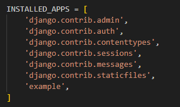

</tr><tr>

-   Empezamos modificando el models.py de nuestra aplicacion:

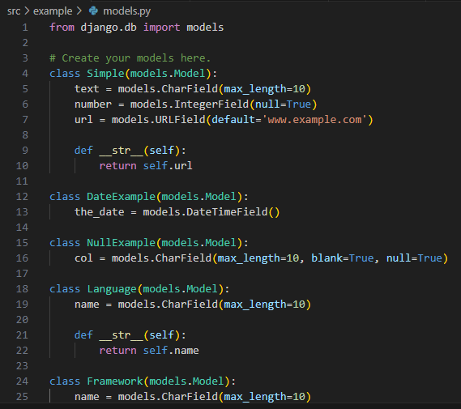

</tr><tr>
-   Realizamos makemigrations y migrate:


</tr><tr>
- Para poder observar, debemos realizar la instalacion del gestor de BD.

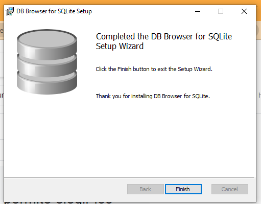
</tr><tr>

- Observamos desde el DB Browser:


</tr><tr>
-  Empezamos a insertar datos desde el shell:

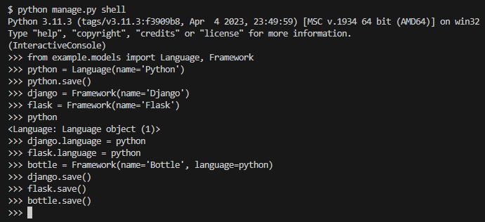

</tr><tr>


-   Podemos observas en las tablas los datos insertados:

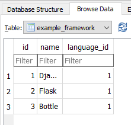
</tr><tr>
-   Continuamos trabajando con el shell:


</tr><tr>
-   Observamos los cambios:

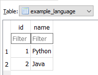
</tr><tr>
-   Tambien observamos en la tabla example_framework:


</tr><tr>

# CONTINUAMOS CON EL VIDEO 20:<br>

-     Realizamos las modificaciones del models.py de nuestra aplicacion:

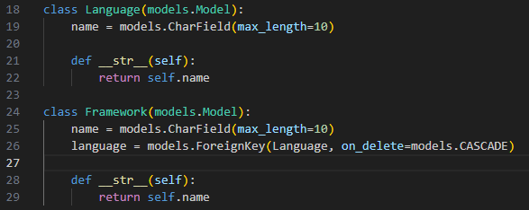
</tr><tr>

-   Trabajamos con filter y all:
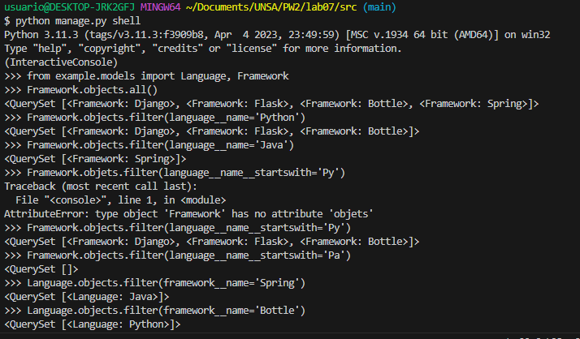

</tr><tr>

# CONTINUAMOS CON EL VIDEO 21:<br>

</tr><tr>

-   Implementando la class Movie y la class Character en el models.py de la aplicación:

```python
    class Movie(models.Model):
    name = models.CharField(max_length=10)

    def __str__(self):
        return self.name

class Character(models.Model):
    name = models.CharField(max_length=10)
    movies = models.ManyToManyField(Movie)

    def __str__(self):
        return self.name

```
</tr><tr>
-   Se muestra la imagen:

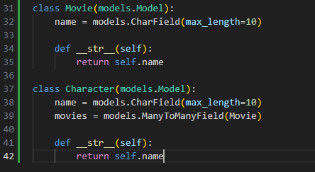

-   Luego de la modificación realizamos python manage.py makemigrations y 
python manage.py migrate.
</tr><tr>


</tr><tr>

-   Insertando datos desde el shell a la tabla Movie y Character:


</tr><tr>
-   Observamos en el gestor los datos insertados desde el shell:

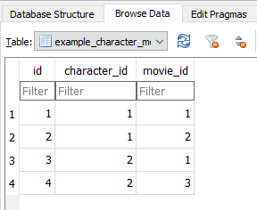

</td><tr>

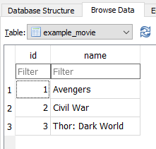

</td><tr>

-   Creando el campo Winter Soldier desde el shell:


</tr><tr>

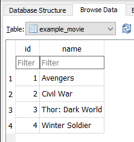

</tr><tr>

# CONTINUAMOS CON EL VIDEO 22:<br>

</tr><tr>

-   En este punto se continúa trabajando con filter, con el get y set:

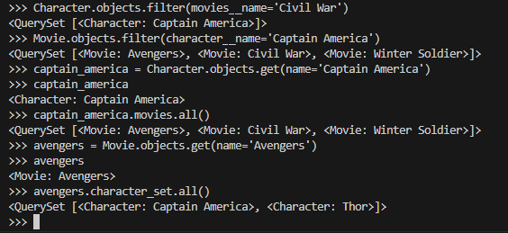

</tr><tr>

# CONTINUAMOS CON EL VIDEO 23:<br>

</tr><tr>

-   Se expone con relacion al uso de las bases de datos con las cuales 
el usuario puede interarctuar.


</tr><tr>

# DJANGO Y PDF:<br>

</tr><tr>

-   Iniciamos esta parte realizando las configuraciones en el settings de nuestro 
proyecto:

```python
   TEMPLATES = [
    {
        'BACKEND': 'django.template.backends.django.DjangoTemplates',
        'DIRS': [os.path.join(BASE_DIR, 'templates')],
        'APP_DIRS': True,

    }
   ]
```


</tr><tr>

-   Ahora para cumplir con los requisitos, instalaremos los paquetes con el siguiente
comando: "pip install --prehhtml2pdf".


</tr><tr>

-   Creamos el archivo utils.py, en este archivo agregamos la funcion
render_to_pdf.

```python
   from io import BytesIO
    from django.http import HttpResponse
    from django.template.loader import get_template
    from xhtml2pdf import pisa

    def render_to_pdf(template_src, context_dict={}):
        template = get_template(template_src)
        html  = template.render(context_dict)
        result = BytesIO()
        pdf = pisa.pisaDocument(BytesIO(html.encode("ISO-8859-1")), result)
        if not pdf.err:
            return HttpResponse(result.getvalue(), content_type='application/pdf')
        return None
```

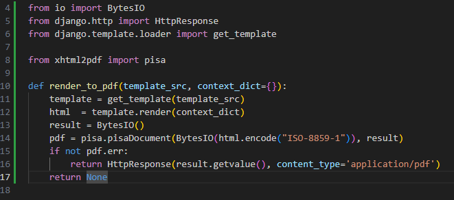

</tr><tr>

-   Creamos una carpeta templates, dentro de ella creamos el archivo invoice.html.


</tr><tr>

-   Creamos un archivo views.py dentro de nuestro proyecto y a quí debemos tener la clase
GeneratePDF(View).


```python
   class GeneratePDF(View):
    def get(self, request, *args, **kwargs):
        template = get_template('invoice.html')
        context = {
            'invoice_id': 123,
            'customer_name': "Omar Romero",
            'amount': 1399.99,
            'today':"Today",
        }
        html = template.render(context)
        pdf = render_to_pdf('invoice.html', context)
        if pdf:
            response = HttpResponse(pdf, content_type='aplication/pdf')
            filename = "Invoice_%s.pdf" %("123456789")
            content = "inline; filename='%s'" %(filename)
            download = request.GET.get("download")
            if download:
                content = "attachment; filename='%s'" %(filename)
            response ['Content-Disposition'] = content
            return response
        return HttpResponse("Not found")
```
</tr><tr>

-   Modificaremos el urls.py:

```python
    urlpatterns = [
        path('admin/', admin.site.urls),
        path('pdf/', GeneratePDF.as_view()),
]
```
</tr><tr>

-   Corremos el servidor y observamos los resultados en el navegador:


</tr><tr>

-   Modificamos la clase GeneratePDF:


</tr><tr>

-   Observamos los resultados:

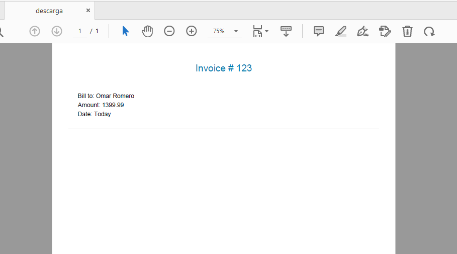

</tr><tr>

-   Realizamos la modificación en la clase GeneratePDF, para retornar el PDF:


</tr><tr>

-   Observamos los resultados:


</tr><tr>

-   Ahora realizamos la modificacion de la clase para poder descargar el PDF:

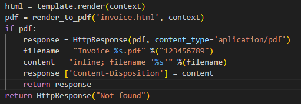

</tr><tr>

-   Observamos los resultados:

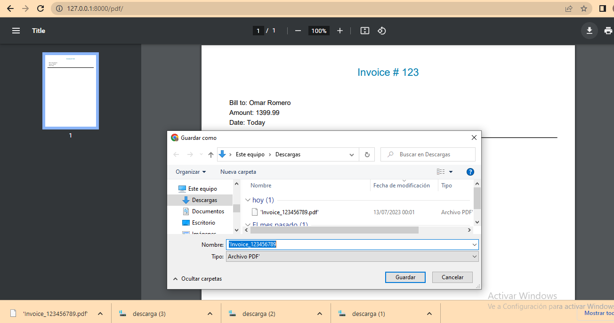

</tr><tr>

-   Hacemos una modificación para implementar el download desde el navegador:


</tr><tr>


<tr><td colspan="6">II. SOLUCIÓN DE CUESTIONARIO: <br>

-   No hay cuestionario para esta réplica 


</tr>
</tr>
<tr><td colspan="6">III. CONCLUSIONES:

-   Se ha interactuado las relaciones uno a uno, uno a muchos, todo se ha realizado desde el shell.. 
</tr>

</tdbody>
</table>


<table>
<theader>
<tr><th colspan="6">RETROALIMENTACIÓN GENERAL</th></tr>
</theader>
<tbody>
</tr>
<tr><td colspan="6">
<ul>
<li><a </a></li>
<li><a </a></li>
<li><a </a></li>
</ul>
</td>
</<tr>
</tdbody>
</table>


<table>
<theader>
<tr><th colspan="6">REFERENCIAS BIBLIOGRÁFICAS</th></tr>
</theader>
<tbody>
</tr>
<tr><td colspan="6">
<ul>
<li>https://www.tutorialspoint.com/What-are-pyc-files-in-Python#:~:text=pyc%20files%20are%20created%20by,is%20newer%20than%20the%20corresponding%20.</li>

<li>https://web.archive.org/web/20160130165632/http://www.network-theory.co.uk/docs/pytut/CompiledPythonfiles.html
</li>

<li></li>
</ul>
</td>
</<tr>
</tdbody>
</table>


